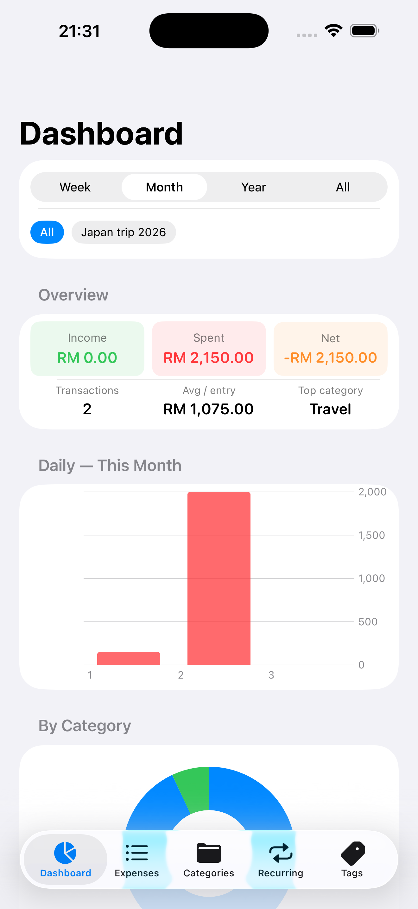
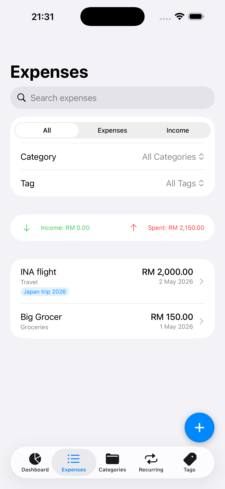
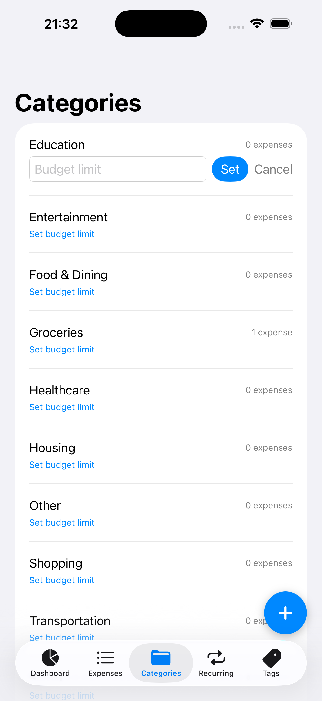

# Expense Tracker

A personal finance app for iOS built with SwiftUI and CoreData. All data stays on-device — no accounts, no cloud, no third-party dependencies.

## Screenshots

| Dashboard | Expenses | Categories |
|-----------|----------|------------|
|  |  |  |

## Features

- Log expenses and income with categories
- Attach receipt photos to any entry
- Set budget limits per category
- Automate recurring bills (daily, weekly, monthly)
- Dashboard with bar chart, donut chart, and savings rate
- Filter by time period and tag
- Organise entries with custom tags

## Requirements

- iOS 17+
- Xcode 15+

## Getting Started

1. Clone the repo
2. Open `ExpenseTracker/ExpenseTracker.xcodeproj` in Xcode
3. Select your target device or simulator
4. Build and run (`Cmd+R`)

No package dependencies to install.

## Running Tests

```bash
xcodebuild -project ExpenseTracker/ExpenseTracker.xcodeproj \
  -scheme ExpenseTrackerTests \
  -destination 'platform=iOS Simulator,name=iPhone 16' \
  test
```

## Architecture

SwiftUI + CoreData, no ViewModel layer. Views hold logic directly via `@FetchRequest` and `@Environment(\.managedObjectContext)`.

See [CLAUDE.md](CLAUDE.md) for full architecture notes.

## License

MIT — see [LICENSE](LICENSE).
